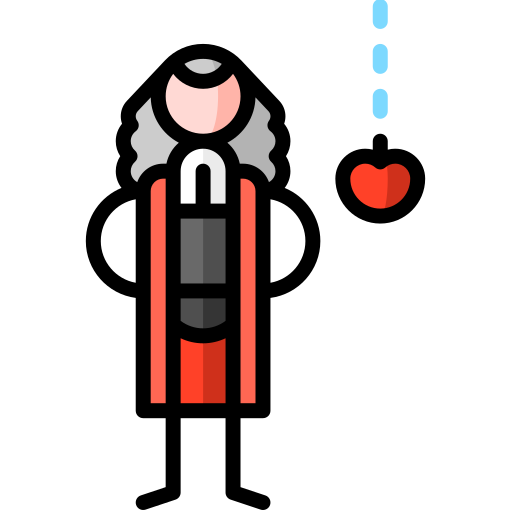
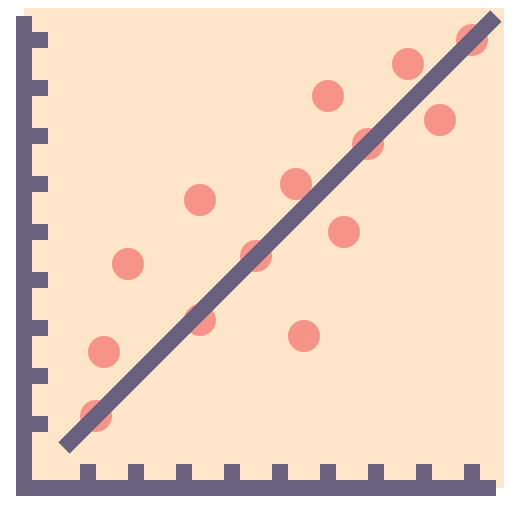
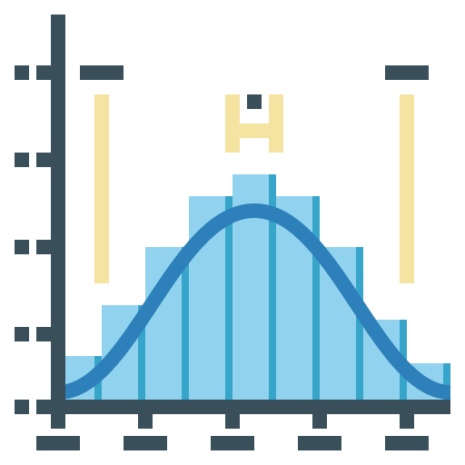
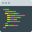

  

    
<h1 align="center">
  <h2 align="center"><strong align="center">Prevendo Valores de Aluguel em SP</strong></h2>
</h1>

 

<h2> Descrição </h2>

  Um data app que prevê o valor do aluguel na cidade São Paulo dado algumas variáveis como bairro, área do imóvel, número de quartos, quantidade de suítes e vagas de garagem.

 

<h2> A ideia </h2>

  

 

  A ideia do projeto surgiu após assistir uma aula da Semana Data Science ministrada pelos irmãos <strong><a href="https://www.linkedin.com/in/felipe-santana-b5515a22/">Felipe</a> e <a href="https://www.linkedin.com/in/rodrigo-santana-ferreira-0ab041128/">Rodrigo</a> Santana</strong> da <a haref="https://minerandodados.com.br/">Minerando Dados</a>. Onde eles criaram um data app que previa o preço de imóveis da cidade de Boston.

Como "comprar um imóvel" (ainda mais em Boston) é uma coisa distante para mim, pensei em trazer o problema para mais próximo de minha realidade. E foi aí que a ideia surgiu.

  Utilizando os conhecimentos adquiridos desde que comecei a estudar Data Science e incentivado por alguns gigantes.

 

No projeto, foi posto em prática alguns conhecimentos como:
  <ul>
    <li>Análise de dados </li>
    <li>Regessão Linear </li>
    <li>Machine Learning </li>
  </ul>
  

  
   
  
  

  E foram utilizadas as bibliotecas:
  <ul>
    <li>pandas </li>
    <li>numpy </li>
    <li>matplotlib.pyplot </li>
    <li>seaborn </li>
    <li>sklearn.ensemble.RandomForestRegressor </li>
  </ul>  

 

<h2> Como rodar o app? </h2>

  No terminal, com a biblioteca streamlit instalada, vá até o caminho do arquivo do script Python e digite o comando:
   
  <code>streamlit run app.py</code>
   

 

<h2> Fonte dos Dados </h2>
<ul>
    <li><a href="https://github.com/LuizArmesto/notebooks/blob/master/regressao_linear/apartamentos_alugar_sao_paulo.csv?raw=true" target="_blank"><strong>Luiz Armesto</strong></a> (Autor do dataset).</li>
</ul>
 

<h2> Autor </h2>

<table>
  <tr>
    <td align="center"><a href="https://www.linkedin.com/in/vini-antunes/" target="_blank"> <b>Vini Antunes</b></a> </td>
  <tr>
</table>

 

<h2> Agradecimentos </h2>

<ul>
  <li><a href="https://github.com/LuizArmesto" target="_blank">Luiz Armesto</a> (por disponibilizar o dados e pela mentoria)</li>
  <li><a href="https://minerandodados.com.br/" target="_blank">Felipe e Rodrigo Santana</a> (pelas aulas na Semana Data Science)</li>
  <li><a href="https://www.mariofilho.com/" target="_blank">Mário Filho</a> (pelas lives esclarecedoras)</li>
  <li><a href="https://www.linkedin.com/in/meigarom/" target="_blank">Meigarom Lopes</a> (pelos vídeos)</li>
</ul>

  
    <adress>
      Icons made by (from <a href="https://www.flaticon.com/br/" target="_blank" title="Flaticon"> www.flaticon.com</a> and <a href="https://icon-icons.com/pt/" target="_blank" title="Icon-Icons">www.icon-icons.com/pt/</a>):
      <ul>
        <li><a href="https://www.flaticon.com/br/autores/xnimrodx" target="_blank" title="xnimrodx">xnimrodx</a>;</li>
        <li><a href="https://www.flaticon.com/br/autores/freepik" target="_blank" title="Freepik">Freepik</a>;</li>
        <li><a href="https://www.flaticon.com/br/autores/becris" target="_blank" title="Becris">Becris</a>;</li>
        <li><a href="https://www.flaticon.com/br/autores/eucalyp" target="_blank" title="Eucalyp">Eucalyp</a>;</li>
        <li><a href="https://www.flaticon.com/br/autores/smalllikeart" target="_blank" title="smalllikeart">smalllikeart</a>;</li>
        <li><a href="https://www.flaticon.com/br/autores/ultimatearm" target="_blank" title="ultimatearm">ultimatearm</a>.</li>
      </ul>
    </adress>
  

